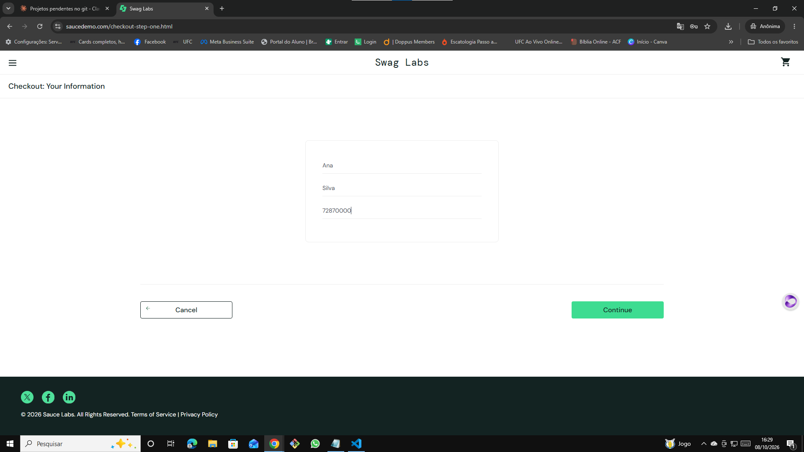
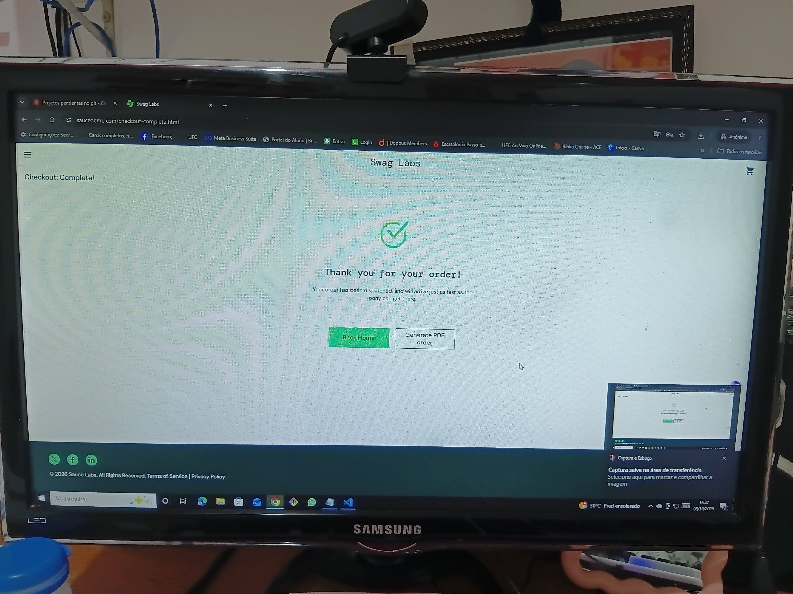

# 🐞 BUG-001 — Sistema permite finalizar pedido com o carrinho vazio

| Campo | Descrição |
|---|---|
| **ID** | BUG-001 |
| **Módulo** | Checkout |
| **Severidade** | Alta |
| **Prioridade** | Alta |
| **Ambiente** | Chrome 155.0.8059.40 · Windows 10 Pro 22H2 · https://www.saucedemo.com |
| **Usuário** | standard_user |
| **Caso relacionado** | Teste exploratório EXP-01 |
| **Data** | 08/10/2026 |

## Pré-condição
Usuário logado com `standard_user` e carrinho vazio (sem número no ícone 🛒).

## Passos para reproduzir
1. Abrir o carrinho
2. Clicar em **Checkout**
3. Preencher First Name `Ana`, Last Name `Silva`, Zip `72870000`
4. Clicar em **Continue**
5. Clicar em **Finish**
6. Clicar em **Generate PDF order**

## Resultado esperado
O botão **Checkout** deveria estar desabilitado com o carrinho vazio, ou o sistema deveria exibir uma mensagem como "Seu carrinho está vazio" e impedir o avanço.

## Resultado obtido
O sistema permite avançar por todas as etapas. A tela de resumo exibe **Total: $0.00** sem nenhum produto e, ao clicar em **Finish**, mostra **"Thank you for your order!"** e o **Generate PDF order** emite um recibo oficial com a seção de itens vazia, informando que o pedido "has been dispatched".

## Evidências
| Etapa | Print |
|---|---|
| Carrinho vazio com botão Checkout ativo |  |
| Resumo do pedido com total $0.00 |  |
| Pedido vazio confirmado |  |
| Recibo em PDF do pedido vazio | [exp02-recibo-pedido-vazio.pdf](../evidencias/exp02-recibo-pedido-vazio.pdf) |

## Impacto
Em um e-commerce real, permitiria criar pedidos sem produtos, gerando registros inválidos no sistema, possíveis disparos de e-mail/logística indevidos e distorção de métricas de vendas.

## Observações
Durante a primeira tentativa, a sessão expirou entre o resumo e o Finish (ver OBS-01). Ao clicar em Finish, a mensagem citou `/checkout-complete.html`, indicando que o sistema já estava redirecionando para a confirmação. Evidência: `exp01-sessao-expirou-no-checkout.png`.
