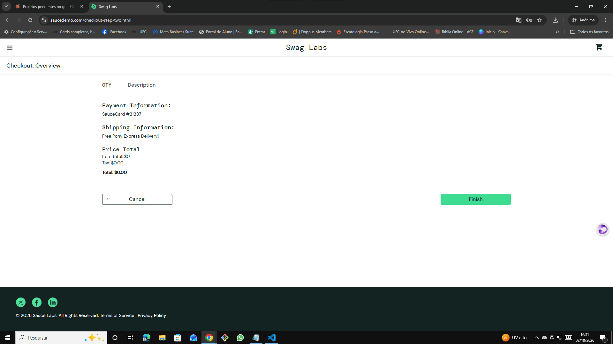

# 🐞 BUG-002 — "Item total" exibido sem casas decimais quando o valor é zero

| Campo | Descrição |
|---|---|
| **ID** | BUG-002 |
| **Módulo** | Checkout |
| **Severidade** | Baixa |
| **Prioridade** | Baixa |
| **Ambiente** | Chrome 155.0.8059.40 · Windows 10 Pro 22H2 · https://www.saucedemo.com |
| **Usuário** | standard_user |
| **Caso relacionado** | Teste exploratório EXP-01 |
| **Data** | 08/10/2026 |

## Pré-condição
Usuário logado com `standard_user` e carrinho vazio.

## Passos para reproduzir
1. Abrir o carrinho e clicar em **Checkout**
2. Preencher First Name `Ana`, Last Name `Silva`, Zip `72870000`
3. Clicar em **Continue**
4. Observar a seção **Price Total**

## Resultado esperado
Todos os valores monetários com o mesmo formato de duas casas decimais: **Item total: $0.00**, Tax: $0.00, Total: $0.00.

## Resultado obtido
**Item total: $0** (sem casas decimais), enquanto Tax e Total aparecem como **$0.00**.

## Evidência

## Observações
Com produtos no carrinho (CT15), o Item total aparece corretamente formatado ($39.98). A inconsistência ocorre quando o valor é zero.
