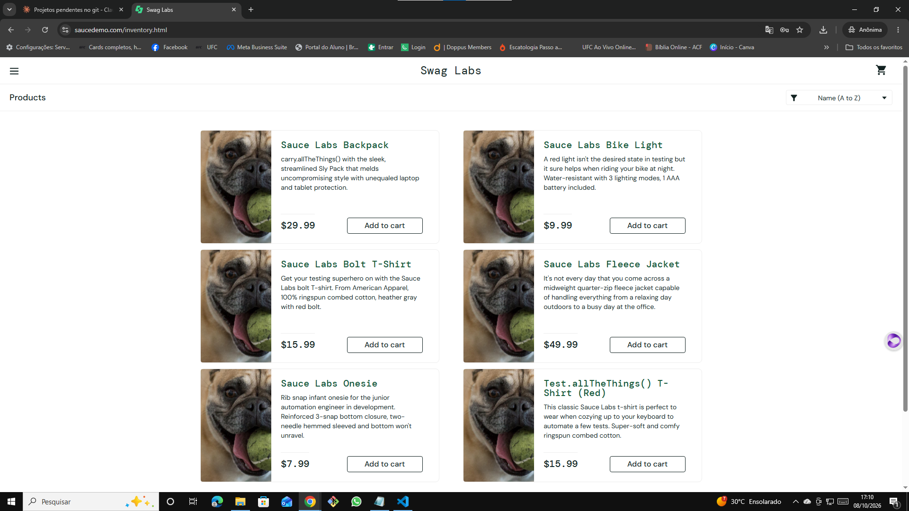

# 🐞 BUG-003 — Todos os produtos exibem a mesma imagem na listagem

| Campo | Descrição |
|---|---|
| **ID** | BUG-003 |
| **Módulo** | Catálogo |
| **Severidade** | Média |
| **Prioridade** | Média |
| **Ambiente** | Chrome 155.0.8059.40 · Windows 10 Pro 22H2 · https://www.saucedemo.com |
| **Usuário** | problem_user |
| **Caso relacionado** | Teste exploratório EXP-03 |
| **Data** | 08/10/2026 |

## Pré-condição
Usuário logado com `problem_user`.

## Passos para reproduzir
1. Fazer login com `problem_user` / `secret_sauce`
2. Observar as imagens da página de produtos

## Resultado esperado
Cada produto exibe a sua própria imagem (mochila, lanterna, camiseta, jaqueta, body infantil e camiseta vermelha), como acontece com o `standard_user`.

## Resultado obtido
Os 6 produtos exibem a mesma foto (um cachorro com uma bola na boca). O cliente não consegue ver o que está comprando.

## Evidências
| Etapa | Evidência |
|---|---|
| Listagem com imagens iguais |  |

## Observações
Na página de detalhes do produto a imagem correta é exibida (ver `exp03-5-detalhes-produto-errado.png`); a falha ocorre apenas na listagem.
