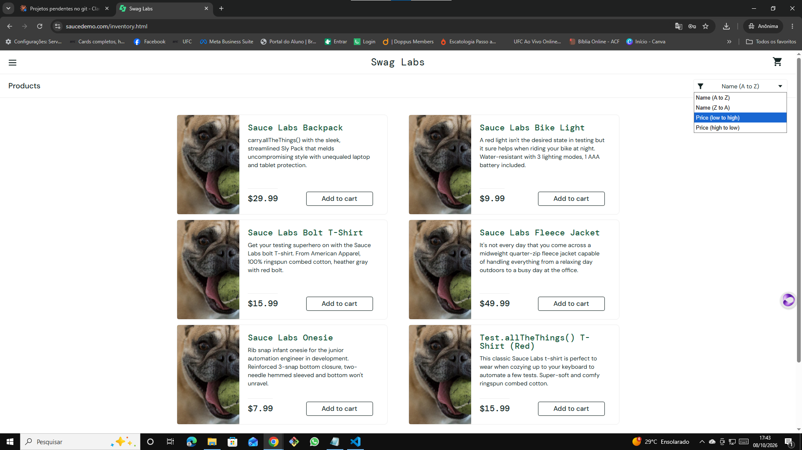
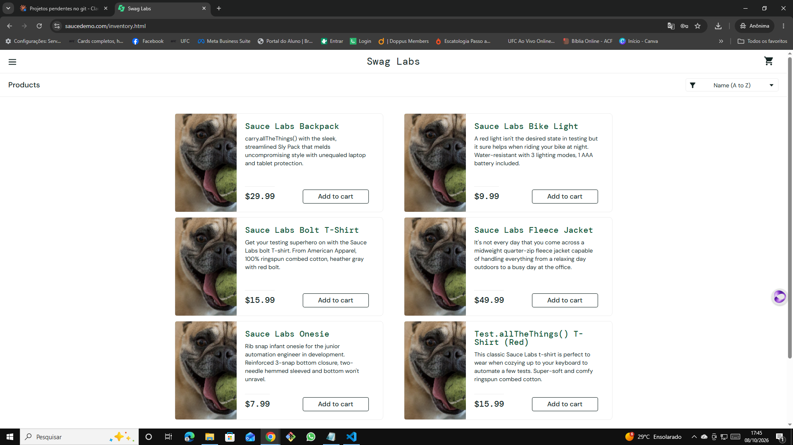
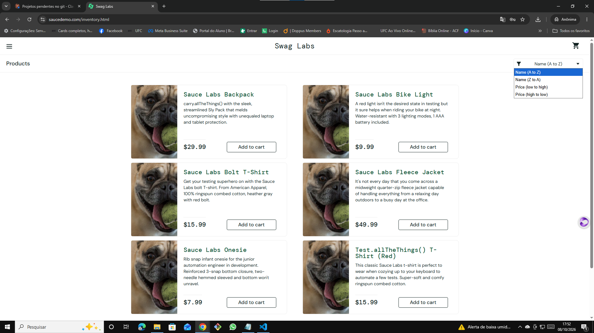
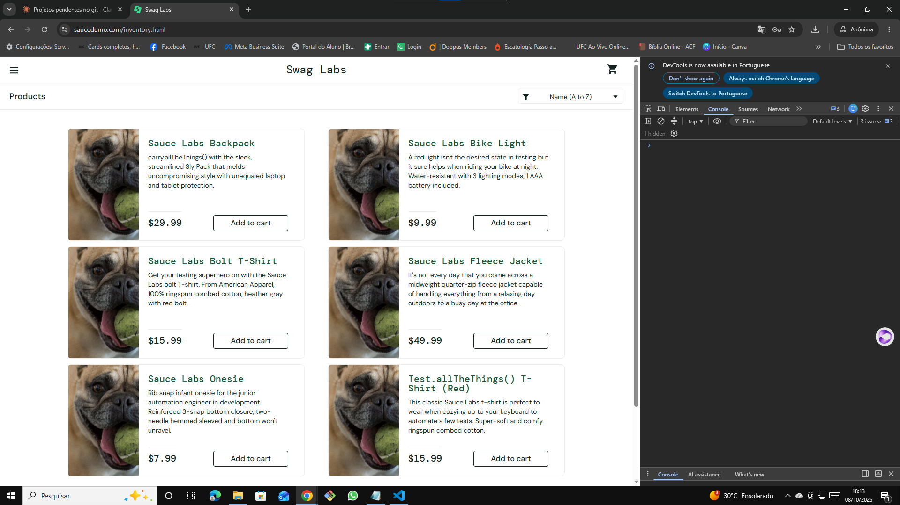

# 🐞 BUG-004 — Ordenação de produtos não funciona e falha sem aviso

| Campo | Descrição |
|---|---|
| **ID** | BUG-004 |
| **Módulo** | Catálogo |
| **Severidade** | Média |
| **Prioridade** | Média |
| **Ambiente** | Chrome 155.0.8059.40 · Windows 10 Pro 22H2 · https://www.saucedemo.com |
| **Usuário** | problem_user |
| **Caso relacionado** | Teste exploratório EXP-03 |
| **Data** | 08/10/2026 |

## Pré-condição
Usuário logado com `problem_user`, na página de produtos.

## Passos para reproduzir
1. Abrir o filtro de ordenação
2. Selecionar **Price (low to high)**
3. Repetir com **Name (Z to A)**

## Resultado esperado
Os produtos são reordenados conforme a opção escolhida, e o filtro exibe a opção selecionada (comportamento do `standard_user` em CT06 e CT07).

## Resultado obtido
A ordem permanece A→Z e o filtro volta a exibir **Name (A to Z)**. Nenhuma mensagem é exibida ao usuário e nenhum erro novo é registrado no Console do navegador.

## Evidências
| Etapa | Evidência |
|---|---|
| Menu aberto antes da seleção |  |
| Ordem inalterada após a seleção |  |
| Opções do menu |  |
| Console sem erro após a seleção |  |

## Observações
Reproduzido 3 vezes, com duas opções diferentes de ordenação. Por não gerar erro no Console, a falha é silenciosa: nem o usuário nem o monitoramento são avisados.
