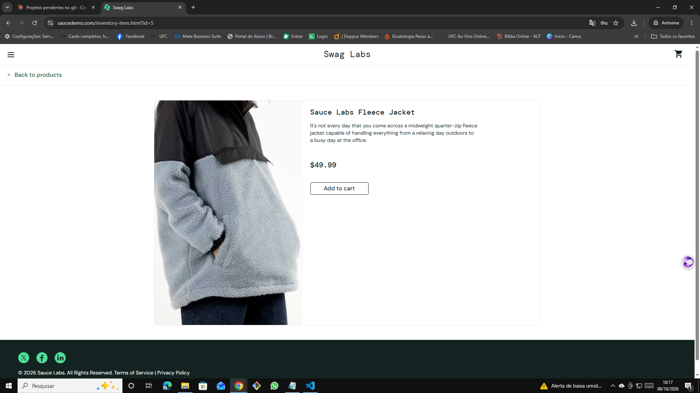

# 🐞 BUG-005 — Clicar em um produto abre a página de outro produto

| Campo | Descrição |
|---|---|
| **ID** | BUG-005 |
| **Módulo** | Catálogo |
| **Severidade** | Alta |
| **Prioridade** | Alta |
| **Ambiente** | Chrome 155.0.8059.40 · Windows 10 Pro 22H2 · https://www.saucedemo.com |
| **Usuário** | problem_user |
| **Caso relacionado** | Teste exploratório EXP-03 |
| **Data** | 08/10/2026 |

## Pré-condição
Usuário logado com `problem_user`, na página de produtos.

## Passos para reproduzir
1. Clicar no nome **Sauce Labs Backpack**
2. Observar o produto exibido e a URL

## Resultado esperado
Abre a página da **Sauce Labs Backpack** ($29.99), com URL `inventory-item.html?id=4`.

## Resultado obtido
Abre a página da **Sauce Labs Fleece Jacket** ($49.99), com URL `inventory-item.html?id=5`.

## Evidências
| Etapa | Evidência |
|---|---|
| Página da Fleece Jacket aberta ao clicar na Backpack |  |

## Observações
Risco de o cliente adicionar ao carrinho um produto diferente do que pretendia comprar.
