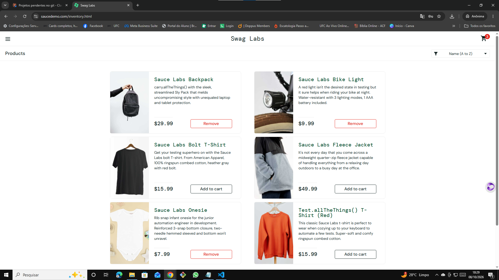

# 🐞 BUG-006 — Botão Add to cart não funciona em 3 dos 6 produtos

| Campo | Descrição |
|---|---|
| **ID** | BUG-006 |
| **Módulo** | Carrinho |
| **Severidade** | Alta |
| **Prioridade** | Alta |
| **Ambiente** | Chrome 155.0.8059.40 · Windows 10 Pro 22H2 · https://www.saucedemo.com |
| **Usuário** | error_user |
| **Caso relacionado** | Teste exploratório EXP-04 |
| **Data** | 08/10/2026 |

## Pré-condição
Usuário logado com `error_user`, carrinho vazio.

## Passos para reproduzir
1. Clicar em **Add to cart** em cada um dos 6 produtos
2. Observar o botão e o contador do carrinho

## Resultado esperado
Todos os botões mudam para **Remove** e o carrinho chega a **6**.

## Resultado obtido
Funciona em Backpack, Bike Light e Onesie. **Não reage** em Bolt T-Shirt, Fleece Jacket e Test.allTheThings() T-Shirt (Red). O carrinho para em **3**.

## Evidências
| Etapa | Evidência |
|---|---|
| Bolt T-Shirt sem reação |  |
| Resultado final: 3 de 6 |  |

## Observações
O botão **Remove** funcionou normalmente nos 3 produtos adicionados (`exp04-3-remover-todos.png`).
