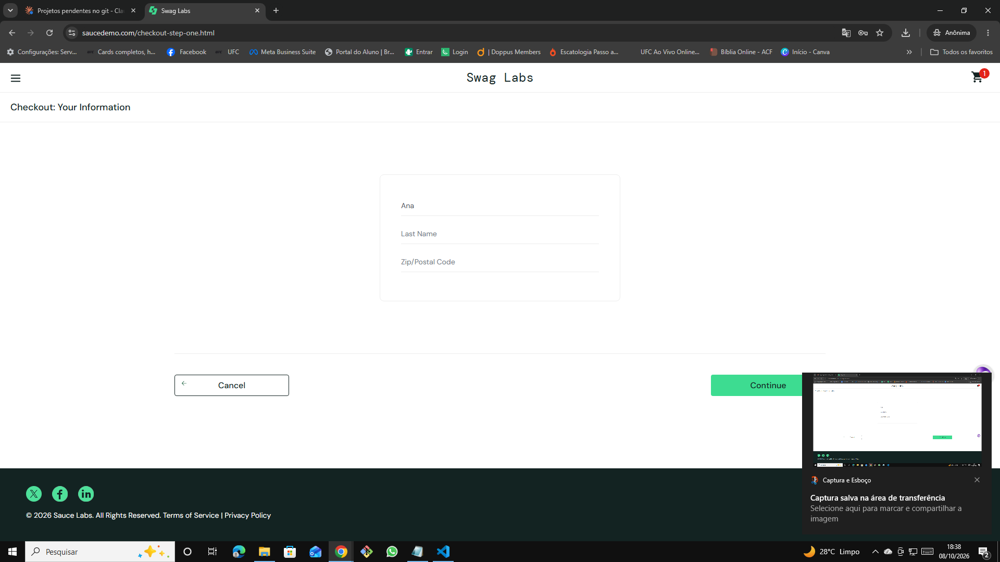

# 🐞 BUG-007 — Campo Last Name não aceita digitação no checkout

| Campo | Descrição |
|---|---|
| **ID** | BUG-007 |
| **Módulo** | Checkout |
| **Severidade** | Alta |
| **Prioridade** | Alta |
| **Ambiente** | Chrome 155.0.8059.40 · Windows 10 Pro 22H2 · https://www.saucedemo.com |
| **Usuário** | error_user |
| **Caso relacionado** | Teste exploratório EXP-04 |
| **Data** | 08/10/2026 |

## Pré-condição
Usuário logado com `error_user`, com 1 produto no carrinho, na tela **Checkout: Your Information**.

## Passos para reproduzir
1. Preencher First Name `Ana`
2. Clicar no campo **Last Name** e digitar `Silva`

## Resultado esperado
O texto digitado aparece no campo Last Name.

## Resultado obtido
O cursor entra no campo, mas o texto não é inserido. O campo permanece vazio.

## Evidências
| Etapa | Evidência |
|---|---|
| Campo Last Name vazio após digitação |  |

## Observações
Relacionado ao BUG-008.
