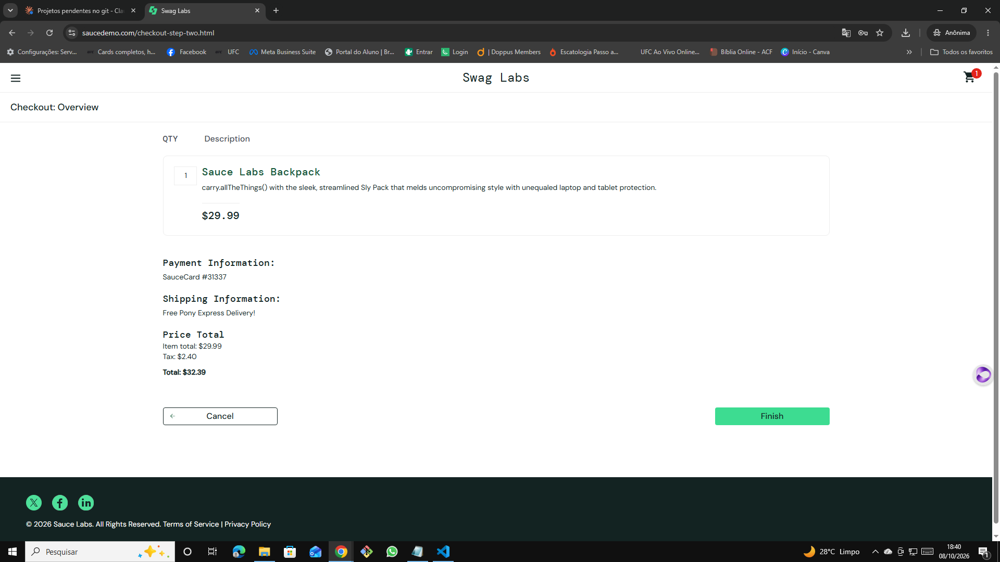

# 🐞 BUG-008 — Checkout avança com o campo obrigatório Last Name vazio

| Campo | Descrição |
|---|---|
| **ID** | BUG-008 |
| **Módulo** | Checkout |
| **Severidade** | Média |
| **Prioridade** | Média |
| **Ambiente** | Chrome 155.0.8059.40 · Windows 10 Pro 22H2 · https://www.saucedemo.com |
| **Usuário** | error_user |
| **Caso relacionado** | Teste exploratório EXP-04 |
| **Data** | 08/10/2026 |

## Pré-condição
Usuário logado com `error_user`, na tela **Checkout: Your Information**.

## Passos para reproduzir
1. Preencher First Name `Ana`
2. Deixar **Last Name** vazio
3. Preencher Zip `72870000`
4. Clicar em **Continue**

## Resultado esperado
Mensagem "Error: Last Name is required" e o checkout não avança (validação existente para o `standard_user`, ver CT13 e CT14).

## Resultado obtido
O sistema avança para **Checkout: Overview** sem o sobrenome.

## Evidências
| Etapa | Evidência |
|---|---|
| Resumo exibido sem o Last Name |  |

## Observações
Valores do resumo corretos: Item total $29.99, Tax $2.40, Total $32.39.
