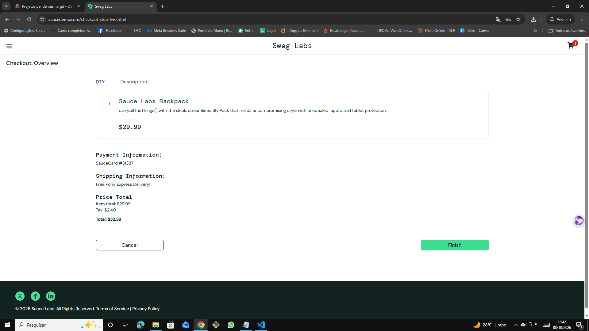
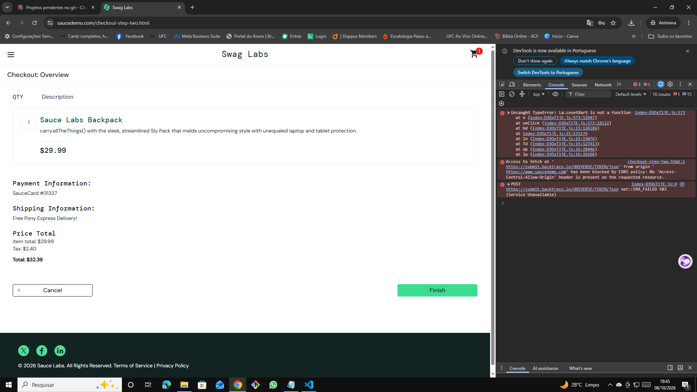

# 🐞 BUG-009 — Botão Finish não conclui a compra (TypeError no clique)

| Campo | Descrição |
|---|---|
| **ID** | BUG-009 |
| **Módulo** | Checkout |
| **Severidade** | Crítica |
| **Prioridade** | Alta |
| **Ambiente** | Chrome 155.0.8059.40 · Windows 10 Pro 22H2 · https://www.saucedemo.com |
| **Usuário** | error_user |
| **Caso relacionado** | Teste exploratório EXP-04 |
| **Data** | 08/10/2026 |

## Pré-condição
Usuário logado com `error_user`, na tela **Checkout: Overview** com 1 produto.

## Passos para reproduzir
1. Clicar em **Finish**
2. Abrir o DevTools (F12) → aba **Console**

## Resultado esperado
Exibir "Thank you for your order!" e concluir o pedido.

## Resultado obtido
Nada acontece; o usuário permanece na tela de resumo e não consegue finalizar a compra. O Console registra `Uncaught TypeError: ... is not a function` disparado no `onClick`, seguido de uma falha (503) ao enviar o erro para o serviço de monitoramento `backtrace.io`.

## Evidências
| Etapa | Evidência |
|---|---|
| Botão Finish sem efeito |  |
| Erro no Console ao clicar |  |

## Observações
A sessão não havia expirado (quando expira, o usuário é redirecionado ao login). O erro de JavaScript indica a causa técnica no handler do clique.
