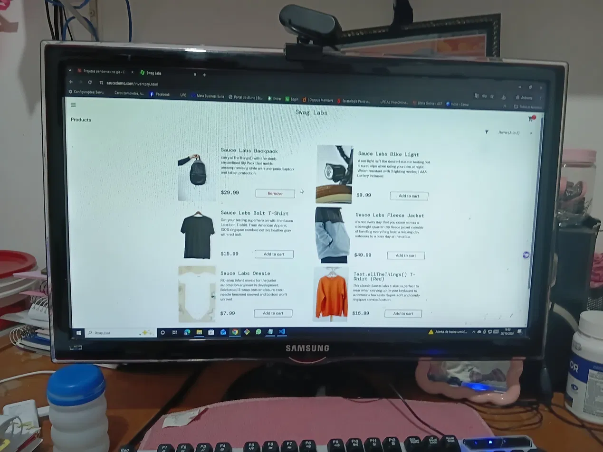

# 🐞 BUG-010 — Carrinho de um usuário aparece para outro usuário no mesmo navegador

| Campo | Descrição |
|---|---|
| **ID** | BUG-010 |
| **Módulo** | Carrinho |
| **Severidade** | Média |
| **Prioridade** | Média |
| **Ambiente** | Chrome 155.0.8059.40 · Windows 10 Pro 22H2 · https://www.saucedemo.com |
| **Usuário** | error_user → performance_glitch_user |
| **Caso relacionado** | Teste exploratório EXP-05 |
| **Data** | 08/10/2026 |

## Pré-condição
Com `error_user`, adicionar a **Sauce Labs Backpack** ao carrinho e não concluir a compra.

## Passos para reproduzir
1. Fazer **Logout**
2. Fazer login com `performance_glitch_user`
3. Observar o carrinho

## Resultado esperado
O carrinho do novo usuário começa vazio; os itens de cada usuário ficam associados à própria conta.

## Resultado obtido
O carrinho exibe **1** item e a Backpack aparece com o botão **Remove**, herdados do usuário anterior.

## Evidências
| Etapa | Evidência |
|---|---|
| Carrinho herdado pelo performance_glitch_user |  |

## Observações
Indica que o carrinho é armazenado no navegador e não na sessão do usuário. Em computador compartilhado, um cliente veria (e poderia comprar) itens de outro.
