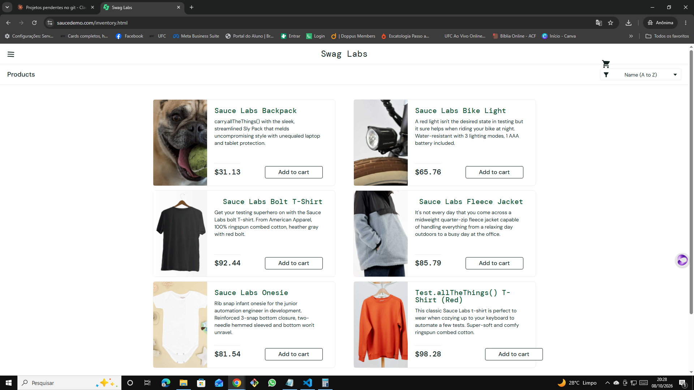
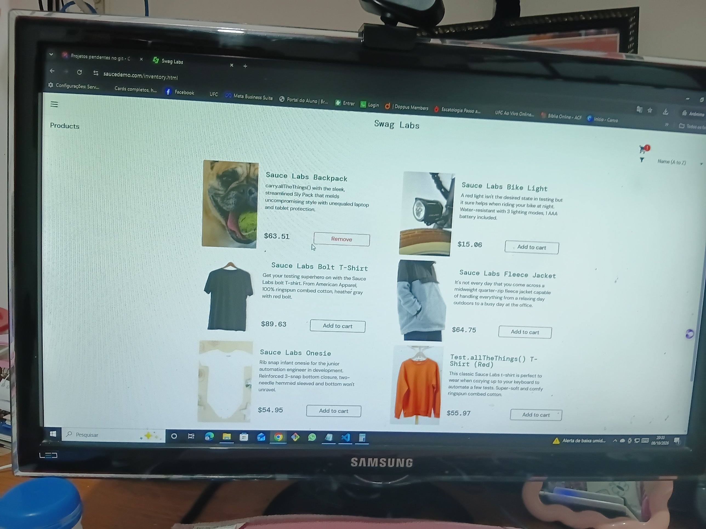
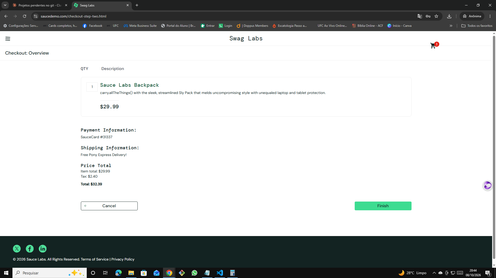

# 🐞 BUG-011 — Preços da listagem são aleatórios e diferentes do valor cobrado

| Campo | Descrição |
|---|---|
| **ID** | BUG-011 |
| **Módulo** | Catálogo / Checkout |
| **Severidade** | Crítica |
| **Prioridade** | Alta |
| **Ambiente** | Chrome 155.0.8059.40 · Windows 10 Pro 22H2 · https://www.saucedemo.com |
| **Usuário** | visual_user |
| **Caso relacionado** | Teste exploratório EXP-06 |
| **Data** | 08/10/2026 |

## Pré-condição
Usuário logado com `visual_user`.

## Passos para reproduzir
1. Observar os preços na página de produtos
2. Recarregar a página (F5) e observar novamente
3. Adicionar a Backpack ao carrinho e seguir até **Checkout: Overview**

## Resultado esperado
Preços fixos e iguais em todas as telas (Backpack $29.99, Bike Light $9.99, Bolt T-Shirt $15.99, Fleece Jacket $49.99, Onesie $7.99, T-Shirt Red $15.99).

## Resultado obtido
Os 6 preços da listagem são diferentes dos reais e mudam a cada carregamento (Backpack: $57.65 → $31.13 → $63.51). No carrinho e no resumo, porém, é cobrado o valor real ($29.99; Total $32.39).

## Evidências
| Etapa | Evidência |
|---|---|
| 1ª carga |  |
| Após recarregar |  |
| Carrinho com o preço real |  |
| Preços mudando ao navegar |  |
| Resumo cobrando o preço real |  |

## Observações
O cliente vê um preço e paga outro. Em loja real, configura divergência de oferta (art. 30 e 31 do CDC).
