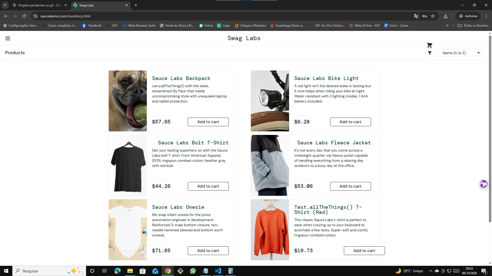

# 🐞 BUG-013 — Ícone do carrinho fora da posição padrão

| Campo | Descrição |
|---|---|
| **ID** | BUG-013 |
| **Módulo** | Layout |
| **Severidade** | Baixa |
| **Prioridade** | Baixa |
| **Ambiente** | Chrome 155.0.8059.40 · Windows 10 Pro 22H2 · https://www.saucedemo.com |
| **Usuário** | visual_user |
| **Caso relacionado** | Teste exploratório EXP-06 |
| **Data** | 08/10/2026 |

## Pré-condição
Usuário logado com `visual_user`.

## Passos para reproduzir
1. Observar o cabeçalho da página de produtos

## Resultado esperado
Ícone do carrinho no canto superior direito, alinhado ao título Swag Labs.

## Resultado obtido
O ícone aparece deslocado para baixo, sobre o filtro de ordenação.

## Evidências
| Etapa | Evidência |
|---|---|
| Ícone do carrinho deslocado |  |
