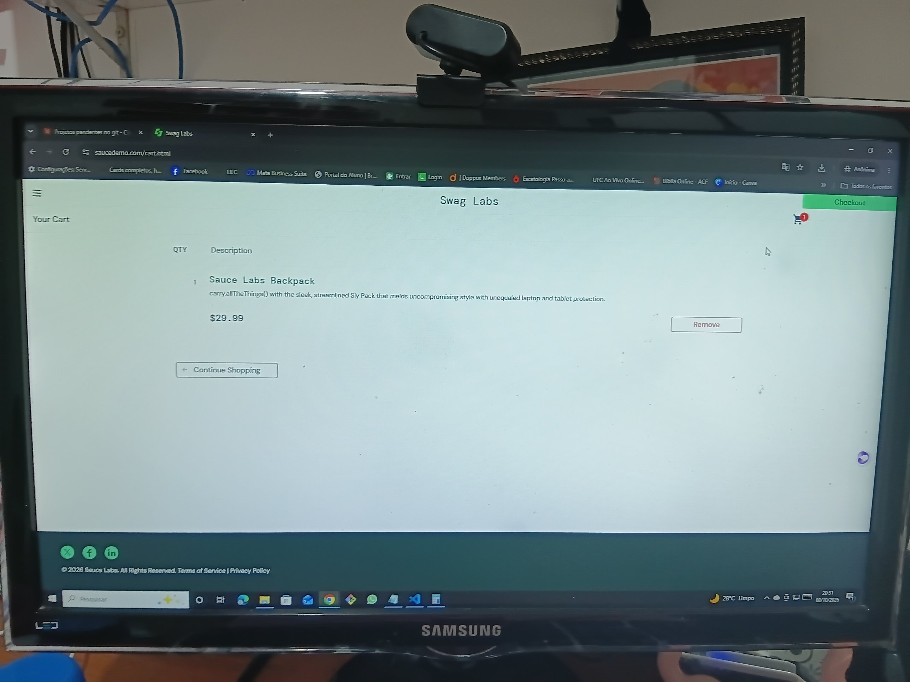
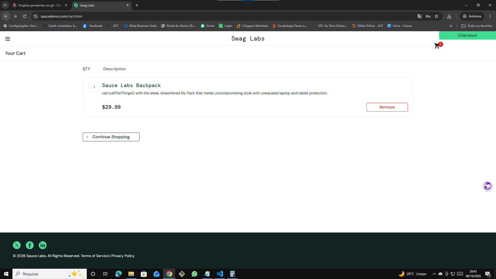

# 🐞 BUG-014 — Botão Checkout fora da posição padrão no carrinho

| Campo | Descrição |
|---|---|
| **ID** | BUG-014 |
| **Módulo** | Layout |
| **Severidade** | Baixa |
| **Prioridade** | Baixa |
| **Ambiente** | Chrome 155.0.8059.40 · Windows 10 Pro 22H2 · https://www.saucedemo.com |
| **Usuário** | visual_user |
| **Caso relacionado** | Teste exploratório EXP-06 |
| **Data** | 08/10/2026 |

## Pré-condição
Usuário logado com `visual_user`, com 1 produto no carrinho.

## Passos para reproduzir
1. Abrir o carrinho
2. Observar a posição do botão **Checkout**

## Resultado esperado
Botão Checkout abaixo da lista de itens, alinhado com o botão Continue Shopping.

## Resultado obtido
O botão aparece no canto superior direito, colado ao cabeçalho. O botão funciona e leva à tela de dados do comprador.

## Evidências
| Etapa | Evidência |
|---|---|
| Carrinho com Checkout deslocado |  |
| Detalhe do botão |  |
